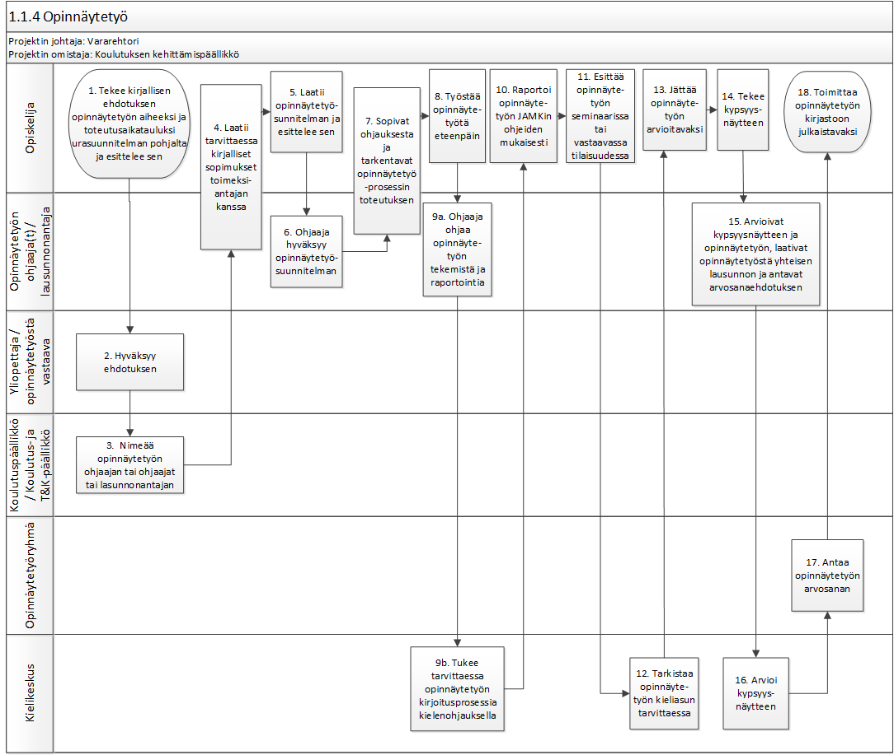
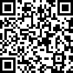

# Reading scissors-palvelun vaatimusmäärittely

Tämä vaatimumäärittely on "elävä"-dokumentti, joka päivittyy jatkuvasti.
<!-- Dokumentti on karkea runko, jota voi käyttää projektien vaatimusmäärittelyn pohjana,
mutta se vaatii muokkausta!
Tavoitteena on luoda dokumentti, joka yhdistää palvelumuotoilun ja ohjelmistosuunnittelun saumattomasti yhteen. Tekijä ei ota mitään vastuuta dokumentin sisällöstä.

tv:NarsuMan -->

## Sisällysluettelo ?

* <a href="#Johdatus">Johdatus</a>
* <a href="#Asiakastarina">Asiakastarina</a>
* <a href="#Sidosryhmät ja profiilikuvaukset">Sidosryhmät ja profiilikuvaukset</a>
* <a href="#Sidosryhmäkuva">Sidosryhmäkuva</a>
* <a href="#Asiakastpolku">Asiakastpolku</a>
* <a href="#Yleinen käyttötapaus">Yleinen käyttötapaus</a>
* <a href="#Yleiset toiminnalliset vaatimukset">Yleiset toiminnalliset vaatimukset</a>
* <a href="#Yleiset ei-toiminnalliset vaatimukset">Yleiset ei-toiminnalliset vaatimukset</a>
* <a href="#Palvelu MockUp">Palvelu MockUp</a>
* <a href="#Tärkeimmät ominaisuudet">Tärkeimmät ominaisuudet</a>
* <a href="#Julkaisun suunnitelma">Julkaisun suunnitelma</a>

## Johdatus

Mikä on tämän vaatimusmäärittelydokumentin tehtävä?
* Mihin se liittyy ?
* Tärkeätä tietää/oleellista lukijalle ?
Tämä dokumentti määrittelee oleelliset asiat

Tämä on vaatimusmäärittely uudelle web palvelulle. Tämän palvelun ydin alue on tarjota käyttäjille työkaluja helpottamaan varsinkin vieraskielisen tekstin lukemista kuvista.

### Palvelukuvaus

Palvelun ydin alue on tarjota käyttäjille työkaluja helpottamaan varsinkin vieraskielisen tekstin lukemista kuvista. Palvelu tulee auttamaan muuntamaan suuria määriä kuvallista-tekstiä sähköiseen muokattavaan muotoon, sekä tarjoamaan erilaisia työkaluja sen kääntämiseen eri kielille.
Palvelulla pyritään helpottamaan erilaisten ihmisten tarpeita saada selvää mitä kuvissa lukee. Palvelu on suunnattu ammattikseen kääntäville henkilöille, tutkijoille, harrastelijoille ja opiskelijoille joilla on tarvetta esimerkiksi kääntää vanha saksankielinen ohjekirja suomeksi.

Palveluun idea on myös tarjota asiakkaalleen niin sanottu "overlay"-tila jossa käännetty teksti näytetään suoraan vanhan päällä. Tämä yhdistettynä mahd. jakaa katselu/muokkaus oikeuksia muille käyttäjille antaa mahd. näyttää käännöstyötä asiakkaalle nopeasti ja menettämättä tekstiin liittyviä kuvia.

### Vaatimusmäärittelytyön tilaaja

Vaatimusmäärittelytyön tilaajana toimii palvelun tekijä Salopää Ari.

### Vaatimusmäärittelyn toimittaja

Vaatimusmäärittelytyön toimittaa Ari Salopää.

## Asiakastarina

[Paul Yeager](asiakasprofiili-2.md) tarvitsee työkalun auttamaan häntä kääntämään 93 sivuisen ranskan kielisen paperisen huolto-oppaan englanniksi yrityksen työntekijöille jaettavaksi.
Paul aloittaa työnsä skannaamalla huolto-oppaan digitaaliseen muotoon ja syöttää kuvat palveluun. palvelussa Paul pystyy valitsemaan sivuilta teksti osion ja antaa koneen tehdä näille automaattisen käännöksen. koneen vielä miettiessä automaattisia käänöksiä Paul pystyy aloittaamaan tarkistamaan ja korjaamaan ensimmäisen sivun automaattisia käännöksiä. Vaikeammissa sanoissa Paul pystyy käyttämään apunaan sivun reunassa olevaa kääntäjää etsiäkseen nopeasti hyvän ja tarkan käännöksen.
Koska kone tekee suuren osan työstä, nopeutuu käännöksen syntyminen huomattavasti ja Paul saa päivässä aikaan huomattavasti enemmän aikaan kuin ilman palvelua. Iltapäivällä Paul pystyykin jo jakamaan oikeudet työkaverilleen, joka pystyy tarkastelemaan alku sivujen tuotosta samalla kun Paul tekee loppupään viimeistelyjä.

Seuraavana päivänä Paul saa työnsä valmiiksi ja lataa käännetyn tekstin tekstitiedostona ulos palvelusta.

## Sidosryhmät (Stakeholders) ja profiilikuvaukset (Profile descriptions)

Palvelun sidosryhmät ovat Palvelun käyttäjät, Palvelun ylläpitäjät, Crakkerit ja Omistaja.

## Sidosryhmäkuva (Stakeholder map)

## Asiakaspolku (Customer Journey)

Malli käyttäjä [Jarkko](asiakasprofiili-1) haluaa nopeasti kuvallisessa muodossa olevasta tehtävästä ottaa tehtävä kuvauksen raporttiinsa ja luo seuraavan laisen asiakaspolun tehdessään sen.

## Tuotteen yleisiä vaatimuksia ja rajoituksia (General Requirements and restrictions)

Nemo enim ipsam voluptatem quia voluptas sit aspernatur aut odit aut fugit,
sed quia consequuntur magni dolores eos qui ratione voluptatem sequi nesciunt. Neque porro quisquam est,
qui dolorem ipsum quia dolor sit amet, consectetur, adipisci velit, sed quia non numquam eius modi tempora
incidunt ut labore et dolore magnam aliquam quaerat voluptatem. Ut enim ad minima veniam,

| Id | Vaatimuksen kuvaus | kategoria | Vastuullinen |
|:-:|:-:|:-:|:-:|
| GENREQ001 | Käyttäjien tunnistus | Tietoturva | - |
| GENREQ002 | Verkkoliikenteen salaus | Tietoturva | - |
| GENREQ003 | Kuvien lataaminen | Käyttäjän sisältö | - |
| GENREQ004 | Vaatimus? | Mikä osa-alue | - |
| GENREQ005 | Vaatimus? | Mikä osa-alue | - |
| GENREQ004 | Vaatimus? | Mikä osa-alue | - |
| GENREQ004 | Vaatimus? | Mikä osa-alue | - |
| GENREQ004 | Vaatimus? | Mikä osa-alue | - |
| GENREQ004 | Vaatimus? | Mikä osa-alue | - |

## Yleiset käyttötapaukset (General Use Cases)

Sed ut perspiciatis unde omnis iste natus error sit voluptatem accusantium doloremque laudantium,
totam rem aperiam, eaque ipsa quae ab illo inventore veritatis et quasi architecto beatae vitae
dicta sunt explicabo. Nemo enim ipsam voluptatem quia voluptas sit aspernatur aut odit aut fugit,
sed quia consequuntur magni dolores eos qui ratione voluptatem sequi nesciunt. Neque porro quisquam est,
qui dolorem ipsum quia dolor sit amet, consectetur, adipisci velit, sed quia non numquam eius modi tempora
incidunt ut labore et dolore magnam aliquam quaerat voluptatem. Ut enim ad minima veniam,
quis nostrum exercitationem ullam corporis suscipit laboriosam, nisi ut aliquid ex ea commodi consequatur?

| Käyttötapaus | Linkki | Muuta |
|:-:|:-:|:-:|
| Käyttötapaus Käyttäjän rekisteröiminen | [Use Case 1](kayttotapaus-1.md) | - |
| Käyttötapaus Käyttäjä kirjautuu palveluun | [Use Case 2](https://github.com/JAMK-IT/TTOS0100-Ohjelmistosuunnittelu-ja-testaus/blob/master/pohja-kayttotapauskuvaus.md) | - |
| Käyttötapaus  | [Use Case 3](https://github.com/JAMK-IT/TTOS0100-Ohjelmistosuunnittelu-ja-testaus/blob/master/pohja-kayttotapauskuvaus.md) | - |
| Käyttötapaus LOREM IPSUM3 | [Use Case 4](https://github.com/JAMK-IT/TTOS0100-Ohjelmistosuunnittelu-ja-testaus/blob/master/pohja-kayttotapauskuvaus.md) | - |
| Käyttötapaus LOREM IPSUM3 | [Use Case 5](https://github.com/JAMK-IT/TTOS0100-Ohjelmistosuunnittelu-ja-testaus/blob/master/pohja-kayttotapauskuvaus.md) | - |

## Palveluun liittyvät toiminnalliset vaatimukset (Functional Requirements)

Sed ut perspiciatis unde omnis iste natus error sit voluptatem accusantium doloremque laudantium,
totam rem aperiam, eaque ipsa quae ab illo inventore veritatis et quasi architecto beatae vitae
dicta sunt explicabo. Nemo enim ipsam voluptatem quia voluptas sit aspernatur aut odit aut fugit,
sed quia consequuntur magni dolores eos qui ratione voluptatem sequi nesciunt. Neque porro quisquam est,
qui dolorem ipsum quia dolor sit amet, consectetur, adipisci velit, sed quia non numquam eius modi tempora
incidunt ut labore et dolore magnam aliquam quaerat voluptatem. Ut enim ad minima veniam,
quis nostrum exercitationem ullam corporis suscipit laboriosam, nisi ut aliquid ex ea commodi consequatur?

| Id | Vaatimuksen kuvaus | kategoria | Vastuullinen |
|:-:|:-:|:-:|:-:|
| REQ001 | Palvelun pitää toimia uusimmassa Mozilla Firefox selaimessa | Mikä osa-alue | Kuka vastaa |
| REQ002 | Palvelun pitää toimia uusimmassa Google Chrome selaimessa | Mikä osa-alue | Kuka vastaa |
| REQ003 | Palvelun pitää toimia uusimmassa Apple Safari selaimessa | Mikä osa-alue | Kuka vastaa |
| REQ004 | Vaatimus? | Mikä osa-alue | Kuka vastaa |
| REQ005 | Vaatimus? | Mikä osa-alue | Kuka vastaa |

## Palveluun liittyvät ei-toiminnalliset vaatimukset (Non Functional Requirements)

Sed ut perspiciatis unde omnis iste natus error sit voluptatem accusantium doloremque laudantium,
totam rem aperiam, eaque ipsa quae ab illo inventore veritatis et quasi architecto beatae vitae
dicta sunt explicabo. Nemo enim ipsam voluptatem quia voluptas sit aspernatur aut odit aut fugit,
sed quia consequuntur magni dolores eos qui ratione voluptatem sequi nesciunt. Neque porro quisquam est,
qui dolorem ipsum quia dolor sit amet, consectetur, adipisci velit, sed quia non numquam eius modi tempora
incidunt ut labore et dolore magnam aliquam quaerat voluptatem. Ut enim ad minima veniam,
quis nostrum exercitationem ullam corporis suscipit laboriosam, nisi ut aliquid ex ea commodi consequatur?

### Suorituskyky? (Performance)

qui dolorem ipsum quia dolor sit amet, consectetur, adipisci velit, sed quia non numquam eius modi tempora
incidunt ut labore et dolore magnam aliquam quaerat voluptatem. Ut enim ad minima veniam,
quis nostrum exercitationem ullam corporis suscipit laboriosam, nisi ut aliquid ex ea commodi consequatur?

| Id | Vaatimuksen kuvaus | kategoria | Vastuullinen |
|:-:|:-:|:-:|:-:|
| REQ00x | Vaatimus? | Suorituskyky | Kuka vastaa |
| REQ00x | Vaatimus? | Suorituskyky | Kuka vastaa |
| REQ00x | Vaatimus? | Suorituskyky | Kuka vastaa |

### Luotettavuus?

qui dolorem ipsum quia dolor sit amet, consectetur, adipisci velit, sed quia non numquam eius modi tempora
incidunt ut labore et dolore magnam aliquam quaerat voluptatem. Ut enim ad minima veniam,
quis nostrum exercitationem ullam corporis suscipit laboriosam, nisi ut aliquid ex ea commodi consequatur?

| Id | Vaatimuksen kuvaus | kategoria | Vastuullinen |
|:-:|:-:|:-:|:-:|
| REQ00x | Vaatimus? | Luotettavuus | Kuka vastaa |
| REQ00x | Vaatimus? | Luotettavuus | Kuka vastaa |
| REQ00x | Vaatimus? | Luotettavuus | Kuka vastaa |

### Tietoturva?

Palvelussa tietoturva on otettu huomioon palvelun

| Id | Vaatimuksen kuvaus | kategoria | Vastuullinen |
|:-:|:-:|:-:|:-:|
| REQ00x | Kaikki liikenne pitää olla salattu | Tietoturva | järjestelmä |
| REQ00x | Oletuksena vain käyttäjä itse näkee omat kuvansa | Tietoturva | järjestelmä |
| REQ00x | Helposti arvattavia salasanoja ei sallita | Tietoturva | järjestelmä |
| REQ00x | Heikkoja salasanoja ei sallita | Tietoturva | järjestelmä |
| REQ00x | Kuvat skannataan viirusten varalta | Tietoturva | järjestelmä |
| REQ00x | Kaikki syöte kentät sanitoidaan | Tietoturva | järjestelmä |

### Käytettävyys

qui dolorem ipsum quia dolor sit amet, consectetur, adipisci velit, sed quia non numquam eius modi tempora
incidunt ut labore et dolore magnam aliquam quaerat voluptatem. Ut enim ad minima veniam,
quis nostrum exercitationem ullam corporis suscipit laboriosam, nisi ut aliquid ex ea commodi consequatur?

| Id | Vaatimuksen kuvaus | kategoria | Vastuullinen |
|:-:|:-:|:-:|:-:|
| REQ00x | Vaatimus? | Käytettävyys | Kuka vastaa |
| REQ00x | Vaatimus? | Käytettävyys | Kuka vastaa |
| REQ00x | Vaatimus? | Käytettävyys | Kuka vastaa |
| REQ00x | Vaatimus? | Käytettävyys | Kuka vastaa |
| REQ00x | Vaatimus? | Käytettävyys | Kuka vastaa |

## Palvelu MockUp-prototyyppi

Palvelun MockUp-prototyyppi on koetettavissa osoitteessa https://ninjamock.com/s/GLJRL

## Tärkeimmät tunnistetut ominaisuudet (Features)

qui dolorem ipsum quia dolor sit amet, consectetur, adipisci velit, sed quia non numquam eius modi tempora
incidunt ut labore et dolore magnam aliquam quaerat voluptatem. Ut enim ad minima veniam,
quis nostrum exercitationem ullam corporis suscipit laboriosam, nisi ut aliquid ex ea commodi consequatur?

| Ominaisuus | Prioriteetti | Muuta |
| :-: | :-: | :-: |
| [Ominaisuus 1](https://github.com/JAMK-IT/TTOS0100-Ohjelmistosuunnittelu-ja-testaus/blob/master/pohja-ominaisuuskuvaus.md) | | |
| [Ominaisuus 2](https://github.com/JAMK-IT/TTOS0100-Ohjelmistosuunnittelu-ja-testaus/blob/master/pohja-ominaisuuskuvaus.md) | | |
| [Ominaisuus 3](https://github.com/JAMK-IT/TTOS0100-Ohjelmistosuunnittelu-ja-testaus/blob/master/pohja-ominaisuuskuvaus.md) | | |
| [Ominaisuus 4](https://github.com/JAMK-IT/TTOS0100-Ohjelmistosuunnittelu-ja-testaus/blob/master/pohja-ominaisuuskuvaus.md) | | |
| [Ominaisuus 5](https://github.com/JAMK-IT/TTOS0100-Ohjelmistosuunnittelu-ja-testaus/blob/master/pohja-ominaisuuskuvaus.md) | | |
| [Ominaisuus 6](https://github.com/JAMK-IT/TTOS0100-Ohjelmistosuunnittelu-ja-testaus/blob/master/pohja-ominaisuuskuvaus.md) | | |
| [Ominaisuus 7](https://github.com/JAMK-IT/TTOS0100-Ohjelmistosuunnittelu-ja-testaus/blob/master/pohja-ominaisuuskuvaus.md) | | |

## Julkaisun suunnitelma

| Aika + Ominaisuuus | Kuvaus | Vastuu | Prioriteetti |
|:-:|:-:|:-:|:-:|
| 1.1.201x [Ominaisuus 1](https://github.com/JAMK-IT/TTOS0100-Ohjelmistosuunnittelu-ja-testaus/blob/master/pohja-ominaisuuskuvaus.md) | | |
| 1.4.201x [Ominaisuus 2](https://github.com/JAMK-IT/TTOS0100-Ohjelmistosuunnittelu-ja-testaus/blob/master/pohja-ominaisuuskuvaus.md) | | |
| 15.4.201x [Ominaisuus 3](https://github.com/JAMK-IT/TTOS0100-Ohjelmistosuunnittelu-ja-testaus/blob/master/pohja-ominaisuuskuvaus.md) | | |
| 5.5.201x [Ominaisuus 4](https://github.com/JAMK-IT/TTOS0100-Ohjelmistosuunnittelu-ja-testaus/blob/master/pohja-ominaisuuskuvaus.md) | | |

# Palvelun/ohjelmiston arkkitehtuuri

### Yleinen sijoittelunäkymä (Deployment diagram )

# Arkkitehtuuriin/teknologiaan liityvät vaatimukset

### Ylläpito (Maintenance)

| Id | Vaatimuksen kuvaus | kategoria | Vastuullinen |
|:-:|:-:|:-:|:-:|
| REQ00x | Vaatimus? | Yllläpito | Kuka vastaa |
| REQ00x | Vaatimus? | Tekninen | Kuka vastaa |
| REQ00x | Vaatimus? | Käytettävyys | Kuka vastaa |
| REQ00x | Vaatimus? | Käytettävyys | Kuka vastaa |
| REQ00x | Vaatimus? | Käytettävyys | Kuka vastaa |

### Yleinen tietokantakuvaus (Database ER-diagram)

ER-kaavio

/Design_Elements(Crows-Foot-ERD).png)

# Testauksen vaatimukset (Testing requirements)

### Testattavuus

| Id | Vaatimuksen kuvaus | kategoria | Vastuullinen |
|:-:|:-:|:-:|:-:|
| REQ00x | Vaatimus? | Testattavuus | Kuka vastaa |
| REQ00x | Vaatimus? | Testattavuus | Kuka vastaa |
| REQ00x | Vaatimus? | Testattavuus | Kuka vastaa |
| REQ00x | Vaatimus? | Testattavuus | Kuka vastaa |
| REQ00x | Vaatimus? | Testattavuus | Kuka vastaa |

# Tunnistetut riskit ja testikohteet

  * Riski -> Testaustarve
  * Vaatimus -> Testaustarve

### Dokumentit, standardit ja lähteet

qui dolorem ipsum quia dolor sit amet, consectetur, adipisci velit, sed quia non numquam eius modi tempora
incidunt ut labore et dolore magnam aliquam quaerat voluptatem. Ut enim ad minima veniam,
quis nostrum exercitationem ullam corporis suscipit laboriosam, nisi ut aliquid ex ea commodi consequatur?

*Lähteet*

| ID | Lähde | Kuvaus | Linkki |
|:-:|:-:|:-:|:-:|
| Id0 | Wikipedia | Vaatimusmäärittely |   https://fi.wikipedia.org/wiki/Ohjelmiston_vaatimusm%C3%A4%C3%A4rittely
- |
| - | -  | - |
| - | -  | - |
| - | -  | - |
